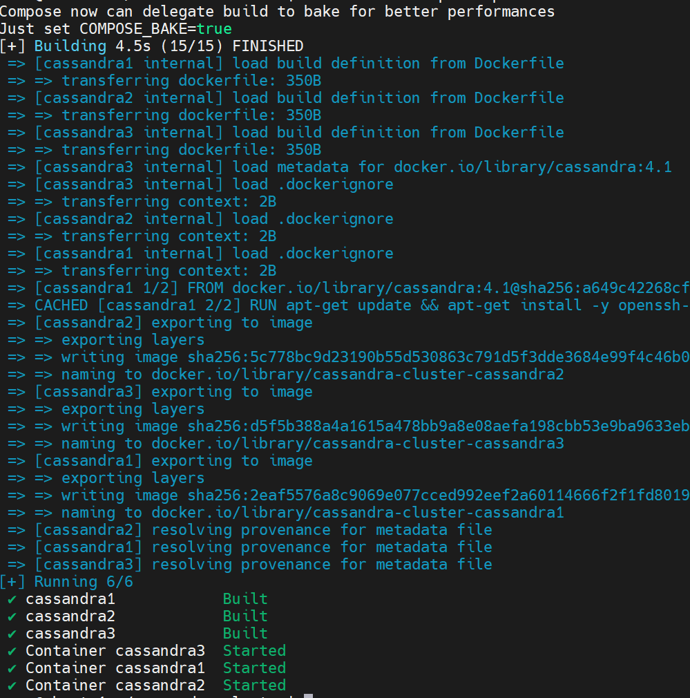
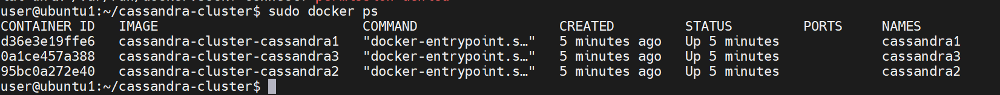
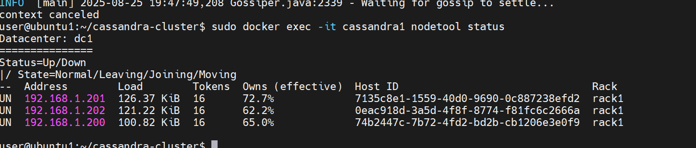
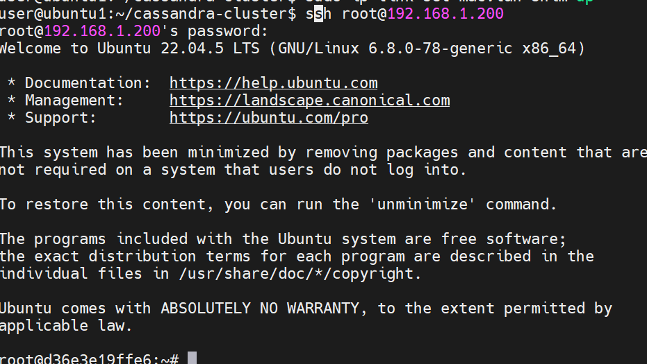
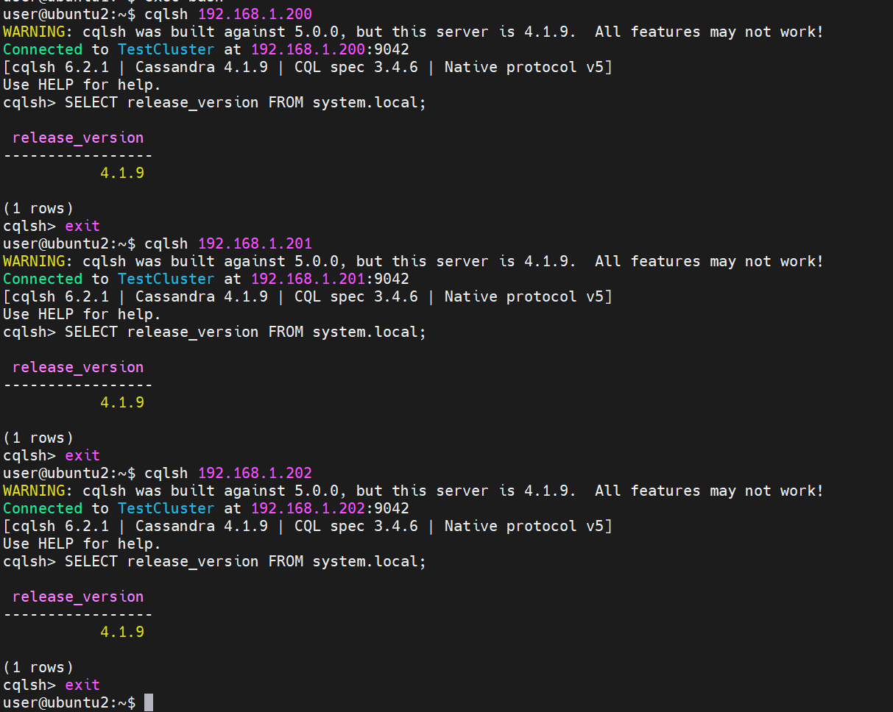

## Введение
### Задача:
1. На машине А (ubuntu 24.04 lts) в локальной сети с ip 192.168.1.197 запускается скрипт docker-compose для поднятия 3 образов с ip адресами 192.168.1.200-202.
2. Затем с машины Б (ubuntu 24.04 lts) из той же локальной сети с ip 192.168.1.198 необходимо подключиться через cqlsh к каждой из машин-образов.
3. Настроить ssh для возможности подключения к 1.200 с 1.197
4. Все приведённые операции необходимо задокументировать и описать инструкцией с командами и объяснениями в Readme
5. Добавить скриншот результата в Readme.

## Настройка
### Хост A
- Установка необходимых пакетов
``` bash
sudo apt update -y
sudo apt install -y docker.io docker-compose
sudo systemctl enable --now docker
```
- Создаём внешнюю сеть с драйвером **macvlan**, чтобы контейнеры имели реальные IP в локальной сети:
```bash
sudo docker network create -d macvlan \
  --subnet=192.168.1.0/24 \
  --gateway=192.168.1.1 \
  -o parent=ens33 \
  cassandra_net
```
`Убедитесь, что интерфейс ens33 соответствует вашему интерфейсу (ip a).`
- Добавить "macvlan bridge" для доступа с хоста к контейнерам
```bash
sudo ip link add macvlan-shim link ens33 type macvlan mode bridge
sudo ip addr add 192.168.1.199/24 dev macvlan-shim
sudo ip link set macvlan-shim up
```
- Создаем директории для проекта
```bash
mkdir -p cassandra-cluster/ssh_setup
```
- Переходим в директорию проекта
```bash
cd cassandra-cluster
```
- Создаем `Dockerfile`
```bash
nano ssh_setup/Dockerfile
```

```bash
FROM cassandra:4.1

RUN apt-get update && apt-get install -y openssh-server \
    && mkdir /var/run/sshd \
    && echo 'root:root' | chpasswd \
    && sed -i 's/#PermitRootLogin prohibit-password/PermitRootLogin yes/' /etc/ssh/sshd_config

EXPOSE 22 9042
CMD /usr/sbin/sshd && docker-entrypoint.sh cassandra -f

```
- Создаем конфигурационный файл `docker-compose.yml`
```bash
nano docker-compose.yml
```

```bash
services:
  cassandra1:
    build: ./ssh_setup
    container_name: cassandra1
    environment:
      - CASSANDRA_CLUSTER_NAME=TestCluster
      - CASSANDRA_SEEDS=192.168.1.200,192.168.1.201,192.168.1.202
      - CASSANDRA_BROADCAST_ADDRESS=192.168.1.200
      - CASSANDRA_ENDPOINT_SNITCH=GossipingPropertyFileSnitch
    networks:
      cassandra_net:
        ipv4_address: 192.168.1.200

  cassandra2:
    build: ./ssh_setup
    container_name: cassandra2
    environment:
      - CASSANDRA_CLUSTER_NAME=TestCluster
      - CASSANDRA_SEEDS=192.168.1.200,192.168.1.201,192.168.1.202
      - CASSANDRA_BROADCAST_ADDRESS=192.168.1.201
      - CASSANDRA_ENDPOINT_SNITCH=GossipingPropertyFileSnitch
    networks:
      cassandra_net:
        ipv4_address: 192.168.1.201

  cassandra3:
    build: ./ssh_setup
    container_name: cassandra3
    environment:
      - CASSANDRA_CLUSTER_NAME=TestCluster
      - CASSANDRA_SEEDS=192.168.1.200,192.168.1.201,192.168.1.202
      - CASSANDRA_BROADCAST_ADDRESS=192.168.1.202
      - CASSANDRA_ENDPOINT_SNITCH=GossipingPropertyFileSnitch
    networks:
      cassandra_net:
        ipv4_address: 192.168.1.202

networks:
  cassandra_net:
    external: true

```
 Запускаем кластер с помощью docker-compose.yml
```bash
sudo docker-compose up -d --build
```

Рисунок 1. Запуск кластера.


Рисунок 2. Список контейнеров.

- Проверяем статус кластера
```
sudo docker exec -it cassandra1 nodetool status
```

Рисунок 3. Проверка статуса кластера.
#### SSH-доступ
Проверка доступа с хоста к контейнеру с ip 192.168.1.200
```bash
ssh root@192.168.1.200
```


Рисунок 4. Проверка ssh подключения к 1.200 с 1.197.
### Хост Б
- Установка необходимых пакетов и подготовка хоста
```bash
sudo apt update -y
sudo apt install -y python3 python3-pip
pip install -U  --break-system-packages cqlsh
echo "export PATH="$HOME/.local/bin:$PATH"" >> .bashrc
source .bashrc
```
- Проверяем подключение через cqlsh к каждой ноде:
```bash
cqlsh 192.168.1.200
cqlsh 192.168.1.201
cqlsh 192.168.1.202
```


Рисунок 5. Проверка подключения через cqlsh к нодам.

## Итог
- Кластер Cassandra успешно поднят на Docker с macvlan.
- SSH-подключение с хоста А к контейнеру `192.168.1.200` работает.
- С машины Б возможен доступ через `cqlsh` ко всем нодам кластера.